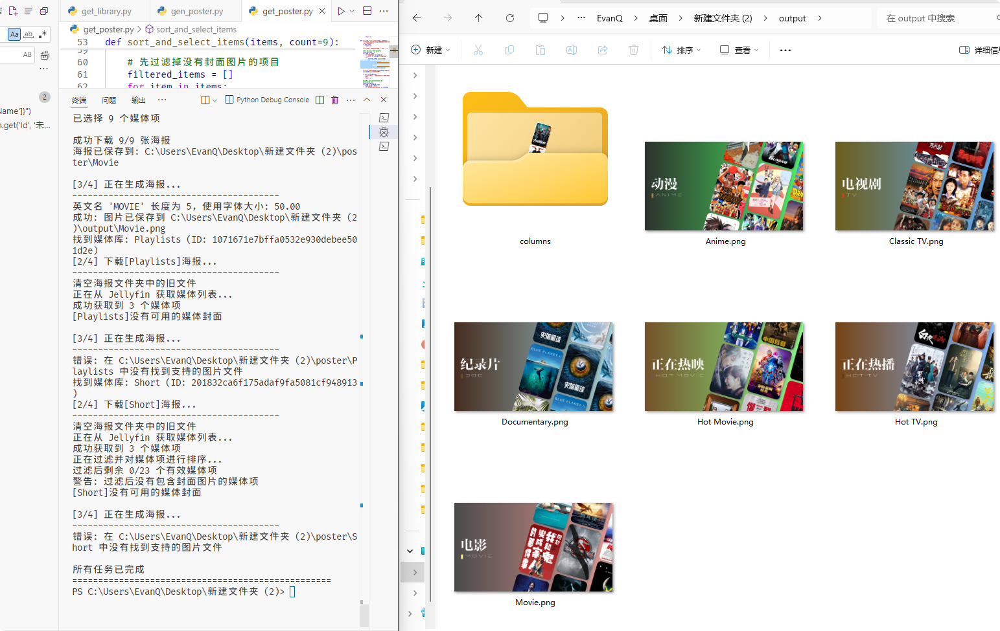

# jellyfin_library_poster

根据媒体库里面的海报(默认最新的 9 张,没有时间就随机)生成媒体库封面并且上传更新
不会 python 随便写的

## 使用说明

```
pip install -r requirements.txt
python main.py
```

## config 配置说明

`config.json` 是项目的配置文件，用于设置 Jellyfin 服务器连接信息和媒体库海报生成的规则。

### 1. Jellyfin 服务器配置

```json
"jellyfin": {
  "base_url": "http://your-jellyfin-server:port",  // Jellyfin 服务器地址
  "user_name": "your-username",                    // 登录用户名
  "password": "your-password",                     // 登录密码
  "update_poster": false                            // 是否自动更新海报
}
```

### 2. 排除更新的媒体库

```json
"exclude_Update_library": ["Short", "Playlists", "合集"]
```

此数组列出不需要自动更新海报的媒体库名称。

### 3. 媒体库模板映射

```json
"template_mapping": [
  {
    "library_name": "Movie",             // Jellyfin 中的媒体库名称
    "library_ch_name": "电影",            // 海报的中文名称（用于海报显示）
    "library_eng_name": "MOVIE"          // 海报的英文名称（用于海报显示）
  },
  // 更多媒体库配置...
]
```

系统会根据这些映射为每个媒体库创建包含相应名称的自定义海报。目前支持的媒体库类型包括：动漫、电视剧、电影、纪录片、合集、正在热映、正在热播和短剧。

### 注意事项

1. 请确保 `base_url`、`user_name` 和 `password` 配置正确
2. `exclude_Update_library` 中列出的媒体库将不会被自动更新海报

## 效果图




